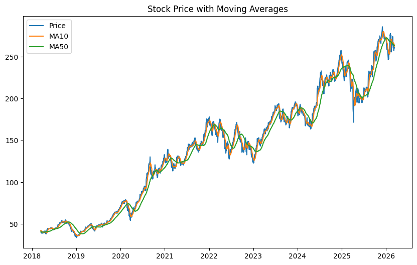

# Stock Return Prediction using Machine Learning

## Overview
Financial markets are notoriously difficult to predict due to their noisy and dynamic nature. Nevertheless, machine learning methods have increasingly been applied in empirical finance to detect patterns in historical market data.

This project implements a simple machine learning pipeline to predict short-term stock price movements using technical indicators. The goal is to demonstrate how predictive models can be applied to financial time series within a reproducible research framework.

---

# Dataset
Historical daily stock price data is downloaded from **Yahoo Finance** using the `yfinance` API.
* **Asset used:** Apple Inc. (AAPL)
* **Time period:** 2018 – Present

---

# Methodology
1. **Feature Engineering:** We construct MA10, MA50, and Rolling Volatility (10-day).
2. **Target Variable:** The model predicts the direction of the next trading day’s return (1 for increase, 0 for decrease).
3. **Machine Learning Model:** A **Random Forest Classifier** is used to capture non-linear relationships in financial data.
4. **Model Evaluation:** We use a 70/30 chronological split to avoid look-ahead bias.

---

# Output
The script produces the following visualization:



*Figure 1: Apple Inc. (AAPL) Closing Prices with 10-day and 50-day Moving Averages.*

---

# Project Structure
```text
stock-return-prediction
│
├── stock_prediction_ml.py    # Main Python script
├── requirements.txt         # Project dependencies
├── README.md                # Project documentation
└── stock_price_with_moving_averages.png  # Analysis chart


---

How to Run
Clone the repository:

Bash
git clone [https://github.com/Chi-Quant-Research/Stock-return-prediction.git](https://github.com/Chi-Quant-Research/Stock-return-prediction.git)
Install dependencies:

Bash
pip install -r requirements.txt
Run the script:

Bash
python stock_prediction_ml.py
Technologies Used
Python: pandas, numpy, scikit-learn, matplotlib, yfinance.

Disclaimer
This project is intended for educational and research purposes only. It does not constitute financial advice.


---